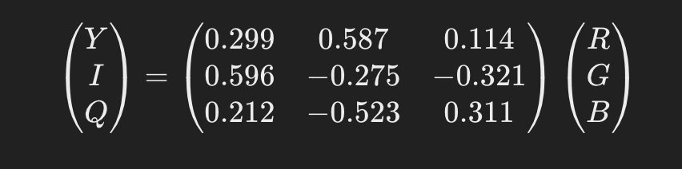
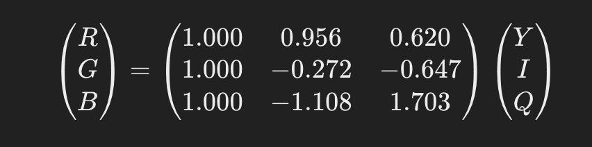
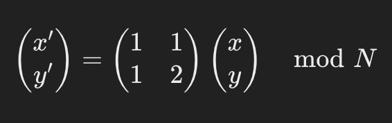
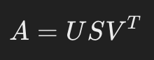
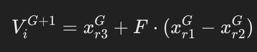
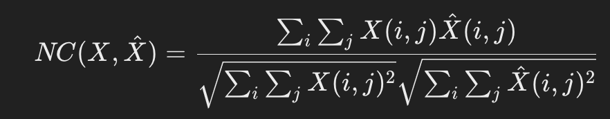
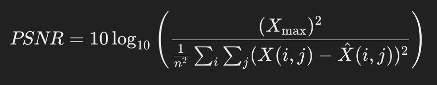
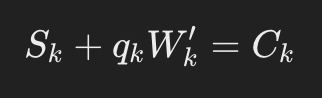

# SUMMARY :

The proposed algorithm enhances the digital watermarking technique by balancing invisibility and robustness, crucial attributes for watermarking algorithms. It begins by converting a color host image from RGB to YIQ space, which aligns better with the human visual system. A three-level discrete wavelet transformation is applied to the luminance component Y, generating four frequency sub-bands. These sub-bands undergo singular value decomposition (SVD). The watermark embedding involves discrete wavelet transformation of a scrambled watermark image, with differential evolution algorithm optimizing the scaling factors for embedding, ensuring an adaptive choice that improves the algorithm's performance.

# IMPLEMENTATION STEPS :

1. **Color Space Conversion:** Convert the color host image from RGB to YIQ space to better match the human visual system.
2. **Wavelet Transformation:** Apply a three-level discrete wavelet transformation to the luminance component (Y) to produce four different frequency sub-bands.
3. **Singular Value Decomposition (SVD):** Perform SVD on these sub-bands.
4. **Watermark Processing:** Apply discrete wavelet transformation to the watermark image after scrambling encryption processing. This step prepares the watermark for embedding.
5. **Differential Evolution (DE) Optimization:** Use the DE algorithm to adaptively select the right scaling factors for embedding the watermark. This is a crucial step to balance invisibility and robustness.
6. **Embedding:** Modify the singular values of the Y component's sub-bands with those of the watermark's sub-bands, adjusted by the scaling factors determined through DE.
7. **Inverse Operations:** Conduct inverse SVD and inverse wavelet transformation to reconstruct the watermarked image in the YIQ space.
8. **Convert Back to RGB:** Transform the watermarked image back to RGB color space for the final output.

# MATHEMATICAL FORMULAES :

1. **Color Space Transformation from RGB to YIQ:**

   

2. **Inverse Color Space Transformation from YIQ to RGB:**

   

3. **Arnold Transform:**

   

4. **Singular Value Decomposition (SVD):**

   

5. **Differential Evolution Mutation:**

   

6. **Objective Function for Optimization:**

   

7. **Normalized Correlation (NC):**

   

8. **PSNR (Peak Signal to Noise Ratio):**

   

9. **Modification of Singular Values for Watermark Embedding:**

   
